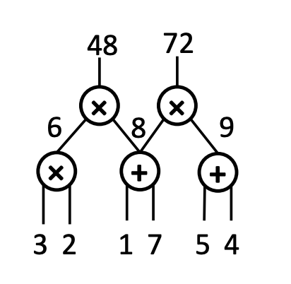
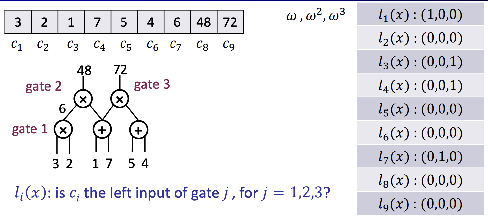

## Overview of Proving systems and Where does Groth16 fit in

The design space of zero knowledge proving systems is quite broad. Generally speaking, the choice of a proving system depends on the combinations of the polynomial commitment scheme and the interactive proof technique:

1. Choice of polynomial commitments
- Pairing based (e.g. KZG): Requires trusted setup
- Discrete log based (e.g. Bulletproof)
- Hashing (e.g. FRI)

2. Choice of polynomial interactive proof (IOP)
- IP
- MIP
- Constant round IOP

Among these choices we study Groth16 in this essay with its main contributions in short verification time. It requires a trusted setup that is circuit specific, and also requires a longer proving time.

Here are the steps we will go through: 

1. From statements to circuit: When we want to prove a certain statement without revealing the secret (i.e. witness) itself, we first want to express the statement in the form of a circuit. By taking in the witnesses as inputs and showing that the output of the circuit is indeed evaluated at a value $y$, we convert a statement to a circuit. Even better, there are programming languages that can convert programs and constraints into circuits.

_Intermediate goal_: I (the prover) know a secret witness such that $C(x, w) = y$ where $x$ are public inputs. 

2. From circuit to Quadratic Arithmetic Program: Now we have a circuit (potentially with many gates and wires) that expresses the statement, how can we evaluate it efficiently without revealing the witness? The intuition here is that if we can express the circuit in a form of one large equation, we can enforce all constraints by every gate of the circuit simultaneously. This is a "quadratic" equation that unless you do know the witness, it is probabilistically hard to find such a witness vector that satisfies the equation. This equation ($p(x)$) is called QAP.

_Intermediate goal_: If I show you a vector that satisfies $p(x) = V(x)q(x)$, it means I do know the private witness. (Don't worry about the functions here for now, let's assume there $V$ and $q$ are some carefully crafted polynomials). 

3. From QAP to SNARK: Now we just have one condition (the large equation) to check the vector for, we can leverage a framework called probabilistically-checkable proof (PCP) that helps us formulate the steps for preprocessing, proof generation and verification.

_Final goal_: If I show you a proof (some values computed from my private witness and some parameters), you can verify the proof using those public paramster and be convinced that I know the witness.

### End Product

At the end of this post we will end up with the following algorithm: 

1. $(\sigma, \tau) <- setup(R)$: The setup takes in some randomness and produce a common reference string (CRS) $\sigma$ (a common value that both the proving and verifying step can use) and a trapdoor $\tau$ (a bypassing value that can be used for proving without CRS). 
2. $\pi <- prove(R, \sigma, \phi, \omega)$: The proving algorithm takes in CRS ($\sigma$), the statement $\phi$ and the witness $\omega$ and returns a proof $\pi$. 
3. $0,1 <- verify(R, \sigma, \phi, \pi)$: The verifying algorithm takes in the proof, the statement and the common reference 
4. $\pi <- simulate(R, \tau, \phi)$: An alternate way of generating a proof with the trapdoor itself, but without the common reference string $\sigma$. 

## Circuit to QAP

To build a QAP from a circuit, we first draw out a circuit and label input and output of every multiplication gate (and ignore the addition gate). In this example we have 3 gates 1, 2, 3 with 3, 2, 1, 7, 5, 4 as inputs of some gates and 6, 48, 72 as outputs of some gates. We label them as w_1...w_9.

We craft a polynomial such that $a_i(x)$ represents whether $w_i$ is the left input of gate $j$. 

Similarly, we have: 
- $b_i(x)$ represents whether $w_i$ is the right input of gate $j$
- $c_i(x)$ represents whether $w_i$ is the output of gate $j$

Eventually, we end up with an evaluation $p(x) = (\sum_{i = 0}^l w_i a_i(x))(\sum_{i = 0}^l w_i b_i(x)) - (\sum_{i = 0}^l w_i c_i(x)) = 0$. This loosely makes sense if you generally agree that "all left inputs of all multiplication gates multiply all of its right inputs sums up to all output gates". 

A technique we can use is by checking randomly at $x = r_1...r_i$, $p(x)$ is always evaluated to 0. Here we introduce a vanishing polynomial defined as $V(x) = \prod_{i = 0}^n (x - r_i)$. Since we know V(x) always evaluated to 0 for $x = r_1...r_q$, we can conclude that:

$p(x) = 0$ if only if $p(x)$ divides by $V(x)$. i.e. There exists a quotient polynomial $q(x)$ such that $p(x) = V(x)q(x)$.

To make things a bit easier later, r_1...r_q are actually $\tau$...$\tau^q$ so $V(x) = \prod_{q = 0}^m (x - \tau^q)$. 

## QAP to SNARK

The general idea to prove the equation above in the exponentiation such that no inputs w_i will be revealed.

That is, if this holds true: $(\sum_{i = 0}^l w_i a_i(x))(\sum_{i = 0}^l w_i b_i(x)) - (\sum_{i = 0}^l w_i c_i(x)) = V(x)q(x)$, then raising it to the power should still hold true: $g^{(\sum_{i = 0}^l w_i a_i(x))(\sum_{i = 0}^l w_i b_i(x)) - (\sum_{i = 0}^l w_i c_i(x))} = g^{V(x)q(x)}$ for some random value $\tau$. 

### Preprocessing Phase

During the preprocessing phase, we generate the following parameters that can be used in proving and verifying. 

The first phase we call it the power of tau by calculating $g^{\tau}, g^{\tau^2}, ... , g^{\tau^m}$. Note that this does not involve variables related to the circuit. In fact, there are popular ceremonies that are done before so you can reasonably trust and download these parameters.

In addition, we calculate the following values based on $\tau$: $g^{a_i(\tau)}, g^{b_i(\tau)}, g^{c_i(\tau)}$ for all $i = 1...m$. Since all $a_i, b_i, c_i$ are circuit dependent, we call this the circuit specific trusted setup. 

We also define the verifying key as following $g^{V(\tau)}$. 

### Linear PCP based SNARK: An Insure Strawman

Remember we want to show we know all $w_i$. Here we calculate each terms related to w_i (on the left hand side) and the term related to q (on the right hand side):

$\pi_1 = g^{\sum_{i = 0}^m w_i \cdot a_i(\tau)}$

$\pi_2 = g^{\sum_{i = 0}^m w_i \cdot b_i(\tau)}$ 

$\pi_3 = g^{\sum_{i = 0}^m w_i \cdot c_i(\tau)}$

$\pi_4 = g^{q(\tau)}$

It is not hard to see the first $\pi_1,2,3$ are not hard to compute with the help of $g^{a_i(\tau)}, g^{b_i(\tau)}, g^{c_i(\tau)}$. $\pi_4$ can be computed with the help of $g^{\tau}, g^{\tau^2}, ... , g^{\tau^m}$. Either needs to know $\tau$!

The verifier can check $e(\pi_1, \pi_2) / e(\pi_3, g) = e(g^{V(\tau)}, \pi_4)$. 

We can easily see that this is evaluated to true since $e(\pi_1, \pi_2) = e(g^{\sum_{i = 0}^m w_i \cdot a_i(x) \cdot \sum_{i = 0}^m w_i \cdot b_i(x)}, g)$, $e(\pi_3, g) = e(g^{\sum_{i = 0}^m w_i \cdot c_i(x)}, g)$ and $RHS = e(g^{V(x)q(x)}, g)$.

### Linear PCP based SNARK: V2 (aka Groth16)

Now that we are familiar with what the protocol looks like with a simple construction, we now take a look at Groth16 which uses the same ingredient but a slightly modified structure to make the proof more efficient and secure.

#### Modified Trusted CRS

In addition to $\tau$, we introduce $\alpha$ and $\beta$. 

Hence we include two additional proving keys: 
- $g^{\alpha}$, $g^{\beta}$, $g^{\beta(a_i(\tau) + \alpha(b_i(\tau)) + c_i(\tau))}$. You will see in a second how we can save a pairing by introducing $\alpha$ and $\beta$. 
- Plus the ones you've seen before: 
    - $g^{a_i(\tau)}, g^{b_i(\tau)}, g^{c_i(\tau)}$ from the power of tau. This is equivalent to knowing $g^{q(\tau)}$.
    - $g^{\tau}, g^{\tau^2}, ... , g^{\tau^m}$

#### Modified Proof

$\pi_1' = g^{\alpha + \sum_{i = 0}^m w_i \cdot a_i(x)}$

$\pi_2' = g^{\beta + \sum_{i = 0}^m w_i \cdot b_i(x)}$ 

$\pi_3' = g^{\sum_{i = 0}^m c_i \cdot (\beta a_i(\tau) + b_i(\tau) + c_i(\tau) + V(\tau)q(\tau))}$

#### Modified Verifier Check

$e(\pi_1, \pi_2) = e(\pi_3, g)e(g^{\alpha}, g^{\beta})$

The math to derive this is quite clever by using the term independent coefficients. 

$LHS = e(g^{(\alpha + \sum_{i = 0}^m w_i \cdot a_i(x))(\beta + \sum_{i = 0}^m w_i \cdot a_i(x))}, g)$

Take the product of each term: 

$LHS = e(g^{\alpha\beta + \alpha \sum_{i = 0}^m w_i \cdot b_i(x) + \alpha \sum_{i = 0}^m w_i \cdot b_i(x) + \sum_{i = 0}^m w_i \cdot a_i(x) + \sum_{i = 0}^m w_i \cdot b_i(x)}, g)$

Then we expand RHS: 

$RHS = e(g^{\sum_{i = 0}^m w_i (\beta a_i(\tau) + \alpha b_i(\tau) + c_i(\tau)) + V(\tau)q(\tau)}, g)e(g^{\alpha\beta}, g)$

Substituting $V(\tau)q(\tau)$ with QAP equation: 

$RHS = e(g^{\sum_{i = 0}^m w_i (\beta a_i(\tau) + \alpha b_i(\tau) + c_i(\tau)) + \sum_{i = 0}^m w_i a_i(\tau) + \sum_{i = 0}^m w_i b_i(\tau) + \alpha\beta}, g)$. 

Since $\alpha$ and $\beta$ are independent of term i, they can be extracted from the summation: 

$RHS = e(g^{\beta \sum_{i = 0}^m w_i a_i(\tau) + \alpha \sum_{i = 0}^m w_i b_i(\tau) + \sum_{i = 0}^m w_i a_i(\tau) + \sum_{i = 0}^m w_i b_i(\tau) + \alpha\beta}, g) = LHS$. 

## Evaluations
When evaluating a non-interactive proving system, we generally care about the following metrics:
1. Trusted setup: For Groth16, every circuit needs its own trusted setup that takes in all circuit specific $a_i, b_i, c_i$ values. This is more work to be preprocessed than transparent setup.
2. Proving time: Dependent on the number of multiplication gates (n) and the number of wires (m) and size of statement (l). For Groth16, it requires $(m+3n-l)$ exponentiations.
3. Proof size: Consists of 3 group elements.
4. Verifying time: Requires 3 pairings and $l$ exponentiations.