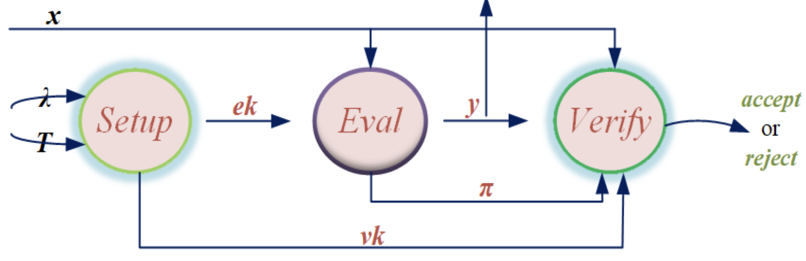

## Verifiable Delay Function Explained with Applications

Verifiable Delay Function is a useful cryptographic primitive that has a wide range of applications such as randomness beacon, proof of replication. Similar to zero knowledge proofs, the output of a verifiable delay function is slow to compute and requires sequential computation, but can be efficiently verified. Unlike Proof of Work that parallel work can be performed across different machines, VDF is required to perform sequentially and cannot be parallelized.

We first define what is a verifiable delay function, the discuss its required properties. Then we go over a few constructions that are widely deployed in applications and an CLI tool for an example. 

We start with a naive VDF construction chaining hash functions. This is true that the result cannot be parallized, because the result of a previous step is used as an input for the current step. However, to verify the result it is required to compute the chaining again, so it is not efficient to verify. 

# Definitions and Properties

A VDF is defined as a tuple of the following 3 functions:  
1. `setup(param) => (ek, vk)`: Given a parameter, outputs an evaluation key and a verifying key. 
2. `eval(ek, x) => y, pi`: Using an input and the evaluation key, evaluate to an output and a proof. Note this step is sequential and cannot be parallelized. 
3. `verify(vk, x, y, pi) => true/false`: Using the verifying key, input, output, and the proof, verifies that the output is indeed computed from the input. 

What are the required properties for the VDF algorithms? 

1. Correctness: A correct output should always verify.

2. Soundness: The possibility to verify an incorrect output is negligle. 

3. Sequentiality: A honest party can evaluate the output in t sequential steps. 

4. Decodability: Given the output, proof and the evaluation key, the input can be decoded. 

5. Incremental: Using the same ek and vk, different difficulty can be supported. That is, the time parameter is only required at the evaluation step not the setup, so for different time delay does not require a different setup. 

## Weak vs. Strong VDF

We distinguish weak and strong VDF here, this is useful for certain constructions discussed later. A weak VDF allows for certain amount of parallelism is needed to give an advantage. 

# Popular Constructions

1. Wesolowski's VDF

We first describes the VDF as an interactive protocol, then we can transform it to non-interactive via Fiat Shamir Heuristics. 

The interactive protocol involves an evaluator and a verifier: 

1. Evaluator computes `a = s^(2^t)`
2. Verifier picks prime l, and send it to the evaluator
3. Evaluator computes `b = s^(2^t/l)`
4. The verifier check: `a == b^l * s^r` where `r = 2^t mod l`. 

Now in the non-interactive form: 

todo

Why is this an VDF? We show that the evaluate step has to be sequential. The verify step is fast bc

todo

Options for choosing the modulus: 

1. RSA: Use N = p*q. This makes the evaluation step slow to compute since p and q are unknown. This requires an MPC trusted setup such that no party should learn the factorization p, q.  

2. Class group with unknown order: This describes a group that are the quotients of P(K)/I(K) where K is a number field and I(K) is the set of fractional ideals of K. This does not require a trusted setup. large prime discriminat. 

2. Pietrzak

choose time param T, a finite abelian group G of unknown order, a hash bytes to element function H

evaluate: y = g^(2^(T/2)) where g = H(x), cannot speed up bc unknown order G
verifier picks r in {1, ... 2^l}

verify: v^r * z = (g^r * v)^2^(T/2)

2. Univariate permutation polynomials

This construction uses the conclusion that given a permutation polynomial of degree t over finite field F_p, invert it requires computing polynomial GCD which is time extensive and sequential. It takes O(log(p)) multiplications of dense polynomial and it cannot be done in t steps on at most O(t^2) processors. This is considered a weak VDF since there can be some paralleization. 

4. Isogeny-based VDF

This class of construction requires more advanced cryptographic knowledge to understand. See [more](https://eprint.iacr.org/2019/166.pdf). On a high level, the evaluation step is a random walk of length depending difficulty. The verification step leverages pairings which can be done very quicky. 

# Applications

1. Randomness beacon

Randomness beacon describes the last revealer advantage problem when generate a randomness collectively. When each party is committed to the partial randomness, the last revealer can wait and decide whether to reveal his partial randomness based on the aggregated randomness result. 

To make the randomness unbiased and hard to manipulate, we use an VDF phase immediately after all parties revealed their randomness. This is to prevent anyone to anticipate what the next seed might be, because the fast hash function is replaced by a very long computation. 

One specific example is leader election during proof of stake consensus. The leader is selected based on the output of VDF after all validators contributed their randomness. [Ethereum](https://ethresear.ch/t/minimal-vdf-randomness-beacon/3566) uses VDF for leader election with strong safety and liveness guarantee. 

2. Proof of data replication

Proof of replication is an applicatin that requires the server to dedicate unique storage for the data even if the data is available from another public source. 

Recall that for a decodable verifiable delay function, the evaluation should take a long time but the decoding is relatively fast. 

When storing the data, the server first  breaks the data into n blocks (b_1...b_n) and make n evaluations (y_1...y_n) where y_i = eval(ek, b_i || H(id || i)). When a verifier request for a copy, the server can return y_i and the verifier can quickly get the b_i with fast decoding. Note that if the server has not storage the data it cannot return y_i, even though it might get b_i from the public. Therefore this scheme ensures the unique storage of certain data. 

# References

1. Paper: https://eprint.iacr.org/2018/601.pdf

2. Walkthrough: https://medium.com/iovlabs-innovation-stories/verifiable-delay-functions-8eb6390c5f4

3. Ethereum discussion: https://ethresear.ch/t/verifiable-delay-functions-and-attacks/2365/8

4. Paper: https://www.mdpi.com/1424-8220/22/19/7524

5. Survey of the first two VDF constructions: https://eprint.iacr.org/2018/712.pdf